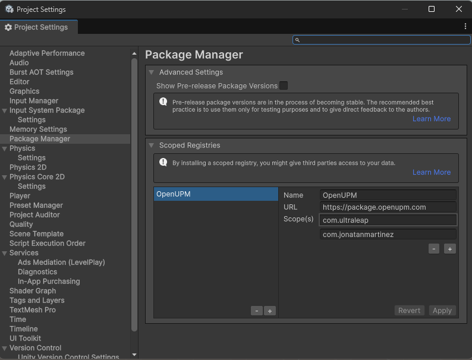
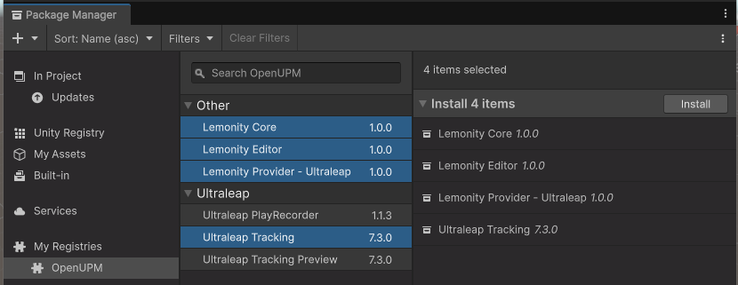

# Lemonity — Hand-based Navigation for Unity

Navigate your Unity scene using bare hands. Lemonity is a Unity Editor extension built around a provider abstraction, so the same interaction model can run on any hand-tracking hardware.

> **Current provider:** Ultraleap (Hyperion runtime)

---

## Requirements

- **Hardware:** Ultraleap hand-tracking device (desktop mode)
- **Software:** [Ultraleap Hyperion runtime](https://developer.ultraleap.com) (must be installed before use)
- **Unity:** 2022.3 LTS or newer

---

## Installation

1. Install the **Ultraleap Hyperion runtime** from [developer.ultraleap.com](https://developer.ultraleap.com).
2. Add the **OpenUPM** scoped registry in **Edit > Project Settings > Package Manager**:
    - **Name:** `OpenUPM`
    - **URL:** `https://package.openupm.com`
    - **Scopes:** `com.jonatanmartinez`, `com.ultraleap`

    


3. Add the following packages to your Unity project via the Package Manager:
   - `com.jonatanmartinez.lemonity.editor`
   - `com.jonatanmartinez.lemonity.provider.ultraleap`
   - `com.jonatanmartinez.lemonity.core`
   - `com.ultraleap.tracking`
    
    


4. Open the Lemonity Options window: **Window › Lemonity Options**
5. Select a working mode (Grab / Orbit / Fly).
6. Connect your Ultraleap device and place it on your desk.

---

## Architecture

Lemonity is organized as three Unity packages:

| Package | Description |
|---|---|
| `com.jonatanmartinez.lemonity.core` | Provider-agnostic runtime: motion styles, gesture controllers, tracking abstraction, options |
| `com.jonatanmartinez.lemonity.editor` | Unity Editor integration: scene view hooks, options window, debug window |
| `com.jonatanmartinez.lemonity.provider.ultraleap` | Ultraleap/Hyperion adapter that implements `HandTracking` and self-registers on editor load |

### Provider pattern

`HandTracking` is an abstract class in `com.lemonity.core`. Each provider registers itself by calling `HandTracking.RegisterProvider()` — in Unity via `[InitializeOnLoad]`. The core never depends on a specific provider, so adding new hardware support requires only a new package that implements `HandTracking`.

```
com.lemonity.core
  └─ HandTracking (abstract)          ← tracking abstraction
  └─ IMotionStyle                     ← motion style interface
  └─ GrabController / PinchController ← gesture recognition
  └─ Options                          ← persistent settings

com.lemonity.provider.ultraleap
  └─ UltraLeapTracking : HandTracking ← Hyperion SDK integration
  └─ UltraleapEditorBootstrap         ← [InitializeOnLoad] self-registration
```

---

## Gestures

| Gesture | How to perform |
|---|---|
| **Grab** | Close all fingers |
| **Pinch** | Join thumb and index fingertip; keep remaining fingers open |

Gesture detection uses **hysteresis** (separate start/stop thresholds) to avoid flickering.

---

## Interaction Modes

### Grab Mode

Direct manipulation. Move and rotate the scene by grabbing it with closed hands.

| Sub-mode | Description |
|---|---|
| **One Hand** | One closed hand moves and rotates the scene |
| **Two Hands** | Both hands control the scene; pinch both hands and spread apart to scale |
| **Hybrid** | Automatically switches between One Hand and Two Hands depending on how many hands are detected |

The **Scene Scale** parameter maps your hand workspace to scene units. Higher scale = less sensitivity but larger range. The **Rotation Factor** multiplies hand rotation so you can cover large angles with less wrist effort.

### Orbit Mode

Orbit the camera around the selected object using the grab gesture.

| Hand movement | Camera effect |
|---|---|
| Left / Right | Yaw (rotate around Y) |
| Up / Down | Pitch (rotate around X) |
| Forward / Backward | Zoom |

**Align feature (Pinch):**
- Simple pinch → center view on selected object
- Pinch + move along an orthogonal axis → align view to that axis

### Fly Mode

Fly freely through the scene using the grab gesture.

| Hands | Action |
|---|---|
| One hand | Move forward/back/strafe and rotate by tilting the hand |
| Two hands | Move and rotate simultaneously |

### Hover Mode

Like Fly mode but altitude is locked to a fixed distance above the ground.

---

## Options

Open the options window at **Window › Lemonity Options** (shortcut: `Alt+L`). Click **Save** to persist your configuration.

### Sensitivity / Scale

| Option | Description |
|---|---|
| Scene Scale | Maps hand workspace to scene units. Higher = less sensitive, larger range |
| Auto Scale on Load | Recalculates scale automatically when a scene is loaded |
| Rotation Factor | Multiplier for hand rotation in Grab mode |
| Zoom Factor | Zoom speed in Grab and Orbit modes |

### Gesture Thresholds

| Option | Description |
|---|---|
| Grab Start Threshold | `GrabStrength` value (0–1) above which grab is triggered |
| Grab Stop Threshold | `GrabStrength` value below which grab is released |
| Pinch Start Distance | Fingertip distance (mm) below which pinch is triggered |
| Pinch Stop Distance | Fingertip distance (mm) above which pinch is released |

### Tracking Filter (One-Euro Filter)

| Option | Description |
|---|---|
| Min Cut Off Frequency | Lower value = less jitter at slow speed |
| Beta Speed Coefficient | Higher value = less lag at fast speed |
| Cut Off for Derivative | Smooths velocity estimation; default 1 |

### Involuntary Gesture Heuristic

Filters gestures that start outside a configurable **Safe Zone Radius** or move in an outward direction, reducing accidental triggers when your hand enters the tracking area. Increase the radius or disable the heuristic if intended gestures are being filtered.

### Inertia

Optionally applies momentum to position and rotation after releasing a gesture, controlled by Angular Drag and Linear Drag.

---

## Debug Window

Open at **Window › Lemonity Debug**. Shows:

- Tracking status (connected / disconnected)
- Per-hand position, grab strength, and pinch distance
- Whether the involuntary gesture heuristic is currently filtering a gesture
- Visual safe zone overlay

---

## Troubleshooting

**Lemonity does not respond after import**  
Restart Unity so the Hyperion native library is loaded.

**Still not working after restart**
1. Open **Window › Lemonity Options** and select a mode (Grab / Orbit / Fly).
2. Open **Window › Lemonity Debug** and verify the device shows as connected.
3. Open the Ultraleap Control Panel and run the Diagnostic Visualizer.

**Settings are not saved**  
Click **Save** at the bottom of the Lemonity Options window.

**Gestures are unreliable**  
Adjust thresholds in the **Gesture Thresholds** section and verify in the Debug window. If gestures are filtered unintentionally, increase the Safe Zone Radius or disable the heuristic.

**A gesture triggers by accident**  
Enable the Involuntary Gestures heuristic and/or decrease the Safe Zone Radius.

---

## License

Copyright 2026 Jonatan Martinez

Licensed under the Apache License, Version 2.0. See [LICENSE](LICENSE) for the full text.

> Third-party SDKs and runtimes (e.g. Ultraleap Hyperion) remain under their own respective licenses.

## Contact

Website: [jonatanmartinez.com/lemonity](https://jonatanmartinez.com/lemonity)  
Support: support@jonatanmartinez.com
